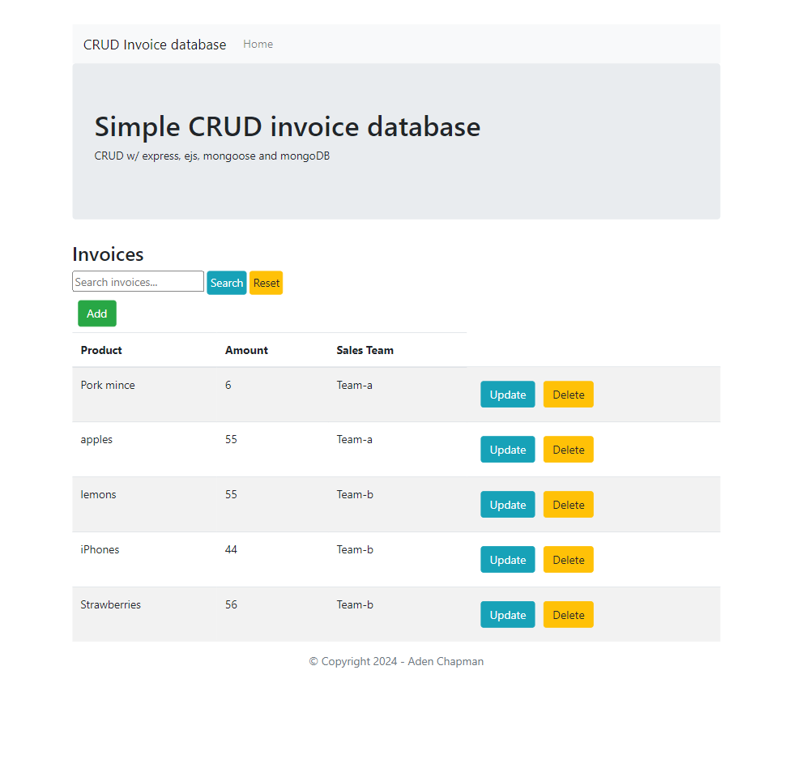
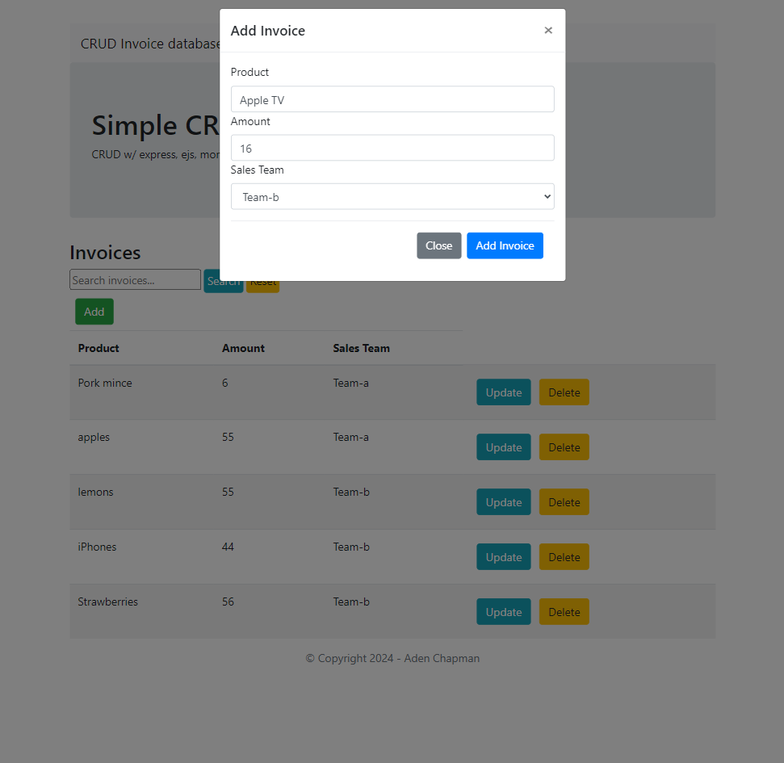
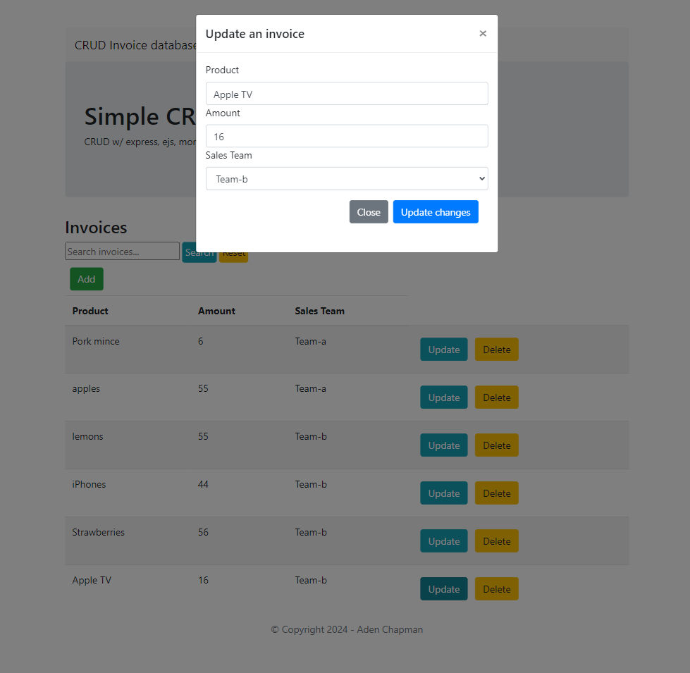
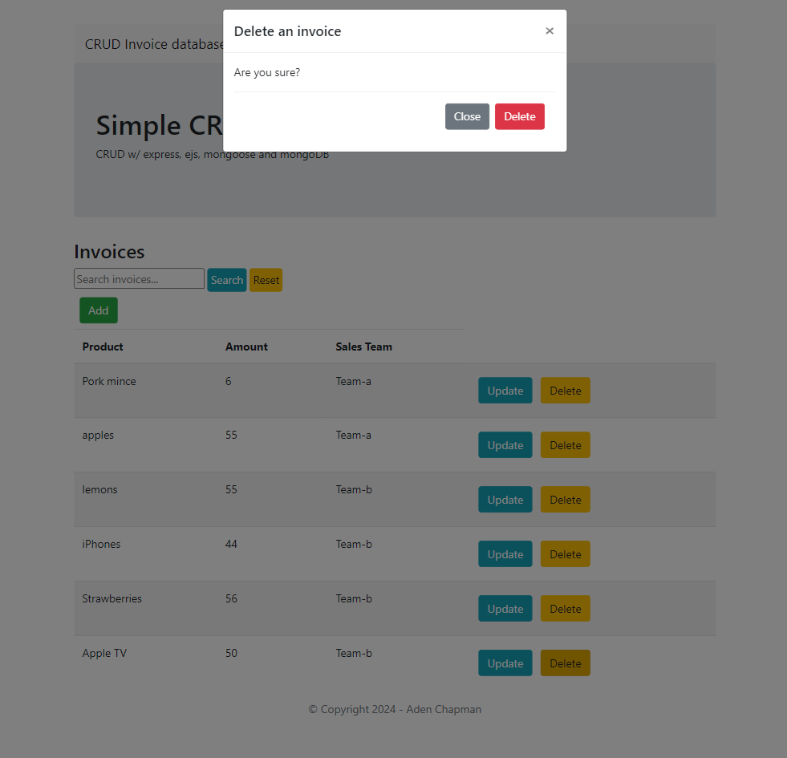
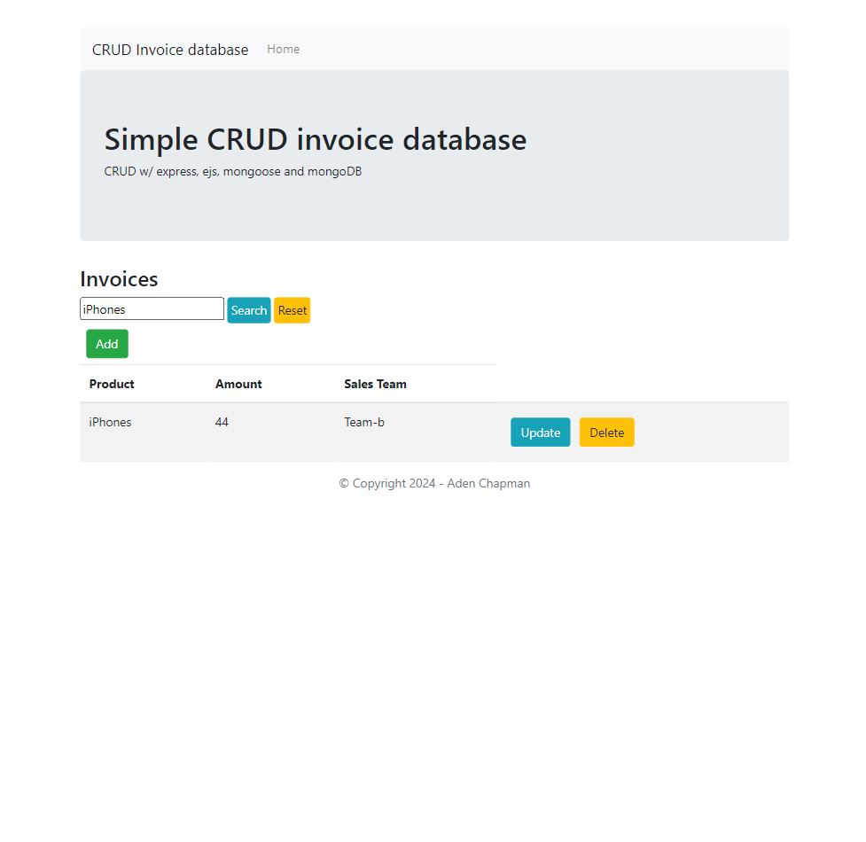

# Invoice Management Application

This Invoice Management Application is a comprehensive solution designed to facilitate the management of invoices within a company. Built with Node.js, Express and leveraging MongoDB for data storage, this application offers a robust platform for creating, updating, deleting, and searching invoices. Here's an overview of its features:

## Technology Stack
- **Backend**: Node.js, Express.js for handling server-side logic and routing.
- **Database**: MongoDB, with Mongoose as the ODM (Object Data Modeling) library for easier data schemas and interactions.
- **Frontend**: EJS (Embedded JavaScript Templates) for dynamic content rendering on the web pages.
- **Middleware**: Uses `cors` for Cross-Origin Resource Sharing, `morgan` for logging HTTP requests, and `dotenv` for managing environment variables.

## Features

### User-Friendly Interface
- **Home Page**: Displays all invoices stored in the database, allowing users to quickly grasp their current invoicing data.  
    

### Invoice Operations
- **Create Invoices**: Users can add new invoices by submitting details about the product, amount, and sales team.  
    
- **Update Invoices**: Existing invoices can be easily updated, ensuring that invoice data remains current and accurate.  
    
- **Delete Invoices**: Invoices can be removed from the database, providing a way to keep the invoicing data clean and relevant.  
    

### Advanced Search Functionality
- **Search Invoices**: Users can search for invoices using keywords, with search capabilities designed to be flexible and user-friendly. The search is case-insensitive and can match partial entries, enhancing the application's usability.

### Secure and Scalable
- **Mongoose Integration**: Utilizes Mongoose for MongoDB object modeling, ensuring robust database interactions and data validation.
- **Environment Variables**: Leverages environment variables for configuration, promoting security and ease of configuration across different environments.

## Getting Started

### Prerequisites
- Node.js and npm (Node Package Manager) installed.
- MongoDB set up and running.

### Installation
1. Clone the repository to your local machine.
2. Navigate to the cloned directory and run `npm install` to install dependencies.
3. Create a `.env` file in the root directory and configure your environment variables (`PORT`, `DB_URL`).
4. Start the application with `npm start` or `node app.js`.
5. Visit `http://localhost:<PORT>` in your browser to access the application.

### Environment Variables
Ensure you have the following environment variables set in your `.env` file:
- `PORT`: The port number on which the server will listen.
- `DB_URL`: Your MongoDB connection string.

## Contributing
Contributions to enhance the application are welcome. Please follow the standard fork-and-pull request workflow.

## License
This project is licensed under the [MIT License](LICENSE).

## Contact
For any queries or further assistance, please contact [Your Contact Information].

Enjoy managing your invoices with ease and efficiency!
